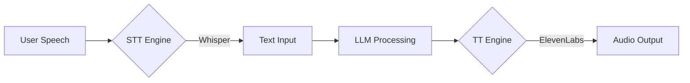

# OpenWebUI vs Commercial LLM Providers: A Comprehensive Analysis of Distinctive Features and Capabilities

OpenWebUI represents a fundamental paradigm shift from commercial large language model (LLM) chat interfaces, offering unprecedented customization, privacy, and extensibility that distinguishes it from proprietary solutions like ChatGPT and Claude AI. With over 300 environment variables for configuration, OpenWebUI provides a level of control and personalization that commercial providers cannot match due to their business models and infrastructure constraints[^1_1]. This analysis examines the key differentiators that make OpenWebUI a unique alternative to commercial web-based LLM chat services.

## Core Architectural Differences

### Self-Hosted Infrastructure and Data Sovereignty

The most fundamental difference between OpenWebUI and commercial providers lies in its self-hosted, open-source architecture. Unlike ChatGPT or Claude AI, which operate as centralized services where user data flows through third-party servers, OpenWebUI runs entirely within the user's own infrastructure[^1_6]. This architectural approach provides complete data sovereignty, ensuring that sensitive conversations, proprietary information, and personal data never leave the organization's control.

OpenWebUI's self-hosted nature eliminates the privacy concerns inherent in commercial platforms, where providers may use conversation data for model training or other purposes[^1_6]. The platform operates entirely offline when desired, making it suitable for organizations with strict data compliance requirements or individuals who prioritize privacy above convenience. This capability is particularly valuable for enterprises handling confidential information, healthcare organizations bound by HIPAA regulations, or government agencies with classified data requirements.

The open-source foundation also enables organizations to audit the codebase, modify functionality according to specific needs, and maintain complete transparency regarding data handling practices[^1_8]. This level of transparency and control is impossible with commercial providers, where the underlying code and data processing mechanisms remain proprietary black boxes.

### Multi-Model Integration and Flexibility

While commercial providers lock users into their specific model ecosystems, OpenWebUI offers unprecedented flexibility in model selection and integration[^1_6][^1_8]. The platform seamlessly integrates with multiple model providers simultaneously, including Ollama for local models, OpenAI-compatible APIs, Anthropic's Claude, and various other providers through standardized interfaces.

This multi-model approach allows users to leverage different models for different tasks within the same interface. For instance, users can employ a lightweight local model for simple queries to maintain privacy while switching to more powerful cloud-based models for complex reasoning tasks[^1_11]. The ability to run conversations with multiple models simultaneously, comparing their responses side-by-side, provides insights into model capabilities that commercial providers cannot offer due to their single-model constraints.

OpenWebUI's native Ollama integration enables users to run sophisticated language models locally on their hardware, completely eliminating dependency on internet connectivity and external services[^1_8]. This local execution capability ensures consistent performance regardless of network conditions and provides access to cutting-edge open-source models that may not be available through commercial APIs.

## Advanced Customization Through Environment Variables

### Granular Configuration Control

OpenWebUI's extensive environment variable system, comprising over 300 configurable parameters, enables granular control over every aspect of the platform's behavior[^1_1]. This level of customization extends far beyond the limited personalization options available in commercial platforms like ChatGPT's custom instructions or Claude's style settings.

The configuration system encompasses fundamental aspects such as authentication mechanisms, user role management, API endpoint configurations, and security policies[^1_1]. Administrators can fine-tune everything from session timeout periods and cookie security settings to RAG embedding models and vector database configurations. This granular control enables organizations to align the platform precisely with their operational requirements, security policies, and user experience preferences.

Commercial providers offer minimal customization options by comparison. ChatGPT's custom instructions are limited to 1500 characters and provide basic personalization[^1_2][^1_15], while Claude's style settings offer predefined options for tone and format[^1_4]. These limitations exist because commercial providers must maintain consistent experiences across millions of users while managing infrastructure costs and maintaining service reliability.

### Persistent Configuration Management

OpenWebUI's PersistentConfig system represents a sophisticated approach to configuration management that commercial providers cannot replicate[^1_1]. This system allows certain environment variables to be stored internally and managed through the web interface, creating a hybrid configuration model where some settings persist across container restarts while others remain dynamic.

This persistent configuration capability enables administrators to establish baseline configurations while allowing runtime adjustments for specific use cases. The system maintains configuration history and provides rollback capabilities, ensuring that experimental changes can be safely tested without risking system stability. Commercial providers cannot offer this level of configuration persistence because their multi-tenant architectures require standardized configurations across user bases.

## Retrieval Augmented Generation (RAG) and Knowledge Integration

### Comprehensive RAG Implementation

OpenWebUI includes a sophisticated RAG system that far exceeds the document upload capabilities of commercial providers[^1_1][^1_8]. The platform supports multiple vector databases including ChromaDB, Elasticsearch, Milvus, OpenSearch, PGVector, Qdrant, and Pinecone, allowing organizations to choose the most appropriate storage solution for their specific requirements.

The RAG system supports hybrid search capabilities combining BM25 keyword search with vector embeddings, providing more accurate and contextually relevant results than simple vector-based approaches[^1_1]. Users can configure chunk sizes, overlap parameters, relevance thresholds, and reranking models to optimize performance for their specific document types and use cases.

Unlike commercial providers that limit document uploads to specific file types and sizes, OpenWebUI supports extensive file format compatibility and configurable upload limits[^1_1]. The platform includes specialized content extraction engines including Apache Tika, Docling, Document Intelligence, and Mistral OCR, enabling accurate text extraction from complex document formats that commercial providers often struggle to process effectively.

### Advanced Document Processing

OpenWebUI's document processing capabilities extend beyond basic text extraction to include image extraction from PDFs, OCR processing for scanned documents, and specialized handling for technical documents[^1_1]. The platform supports configurable text splitting strategies, including character-based and token-based approaches, optimized for different document types and processing requirements.

The system's YouTube RAG pipeline demonstrates capabilities that commercial providers lack entirely, enabling users to extract and index content from video sources for subsequent querying[^1_11]. This multimedia content integration provides comprehensive knowledge bases that incorporate diverse information sources beyond traditional text documents.

## Tools, Functions, and Pipeline Architecture

### Extensible Tool System

OpenWebUI implements a sophisticated tool system that enables real-time data integration and external service connectivity[^1_16][^1_18]. Unlike commercial providers that offer limited plugin ecosystems, OpenWebUI's tools can access live data sources, execute code, interact with APIs, and perform complex integrations with existing business systems.

The platform distinguishes between tools that enhance LLM capabilities and functions that extend the WebUI platform itself[^1_16]. Tools enable AI models to fetch real-time weather data, stock market information, flight tracking, and other dynamic information sources. Functions provide platform-level enhancements including custom UI elements, smart content filtering, and integration with specialized AI models.

This extensibility enables organizations to create custom workflows that integrate AI capabilities with existing business processes. The open architecture allows developers to build specialized tools for industry-specific requirements, creating capabilities that commercial providers cannot offer due to their generalized approach.

### Pipeline Framework for Advanced Workflows

The Pipeline Framework represents OpenWebUI's most distinctive feature, enabling custom logic integration and Python library incorporation that commercial providers cannot match[^1_8][^1_18]. Pipelines allow organizations to implement sophisticated preprocessing, postprocessing, and routing logic that transforms how AI models process and respond to queries.

Examples of pipeline implementations include function calling systems, user rate limiting, usage monitoring with tools like Langfuse, live translation with LibreTranslate, and toxic message filtering[^1_8]. These capabilities enable organizations to implement governance, compliance, and quality control measures that commercial providers cannot accommodate within their standardized platforms.

The pipeline architecture supports complex workflow automation, enabling multi-step processes that combine AI inference with business logic, data validation, and external system integration. This capability transforms OpenWebUI from a simple chat interface into a comprehensive AI platform that can orchestrate complex business processes.

## User Management and Access Control

### Granular Role-Based Access Control

OpenWebUI implements sophisticated user management capabilities that exceed the simple subscription tiers offered by commercial providers[^1_1][^1_8]. The platform supports detailed user roles, permissions, and group management, enabling administrators to create customized access levels that align with organizational hierarchies and security requirements.

The system supports configurable user registration processes, including pending user approval workflows and custom overlay content for new users[^1_1]. Administrators can control model access, feature availability, and data export capabilities on a per-user or per-group basis, providing flexibility that commercial providers cannot offer due to their standardized service models.

The platform includes webhook integration for Discord, Slack, and Microsoft Teams, enabling organizations to integrate AI capabilities with existing communication workflows[^1_1]. This integration capability allows teams to access AI assistance within their preferred collaboration platforms while maintaining the advanced features and customization options that OpenWebUI provides.

### Enterprise-Grade Security Features

OpenWebUI's security implementation includes configurable session management, cookie security settings, CORS policies, and SSL configuration options that enterprises require for production deployments[^1_1]. The platform supports custom authentication providers, API key management with endpoint restrictions, and JWT token configuration for secure API access.

The system includes specialized security features such as SSL assert fingerprint validation, bypass options for model access control, and configurable user information forwarding headers[^1_1]. These capabilities enable integration with existing enterprise security infrastructure while maintaining the flexibility to adapt to specific organizational requirements.

## Conclusion

OpenWebUI's extensive customization capabilities, multi-model integration, advanced RAG implementation, and extensible architecture create a fundamentally different platform compared to commercial LLM providers. While ChatGPT and Claude AI offer polished, user-friendly experiences optimized for general consumption, OpenWebUI provides the flexibility, control, and extensibility that organizations require for serious AI integration. The platform's open-source foundation, comprehensive configuration system, and advanced features enable use cases that commercial providers cannot support due to their business models and architectural constraints. For organizations prioritizing data sovereignty, customization, and advanced AI capabilities, OpenWebUI represents a compelling alternative that delivers functionality impossible to achieve with commercial web-based LLM services.

<div style="text-align: center">⁂</div>

[^1_1]: [^1_2]: https://help.openai.com/en/articles/8096356-chatgpt-custom-instructions-faq

[^1_3]: https://www.linkedin.com/pulse/how-personalize-your-chatgpt-settings-better-results-justin-meredith-6egoc

[^1_4]: https://anthemcreation.com/en/artificial-intelligence/custom-styles-claude-ai/

[^1_5]: https://www.youtube.com/watch?v=U7tkvkGbjKw

[^1_6]: https://www.pondhouse-data.com/blog/introduction-to-open-web-ui

[^1_7]: https://www.youtube.com/watch?v=1jahR-BA6Ts

[^1_8]: https://pypi.org/project/open-webui/

[^1_9]: https://community.openai.com/t/customize-your-interface-for-chatgpt-web-custom-css-inside/315446

[^1_10]: https://www.gate2ai.com/gpt/chatgpt-settings.html

[^1_11]: https://portkey.ai/blog/librechat-vs-openwebui

[^1_12]: https://www.aiforged.io/blog/news-3/comparison-between-claude-desktop-copilotkit-and-openwebui-24

[^1_13]: https://chromewebstore.google.com/detail/gpthemes-chatgpt-customiz/bghdlfnkbghekhdadaokecnhkcodfcna

[^1_14]: https://docs.openwebui.com/features/

[^1_15]: https://www.godofprompt.ai/blog/how-to-use-custom-instructions-for-chatgpt

[^1_16]: https://blog.elest.io/openwebui-free-open-source-chatgpt-alternative/

[^1_17]: https://chromewebstore.google.com/detail/chatgpt-style-customizer/cfeofdepeffaojfahhjmmpolnbjoobkk

[^1_18]: https://dev.to/airabbit/extending-open-webui-beyond-a-chatgpt-alternative-7eo

[^1_19]: https://www.youtube.com/watch?v=GnHdqujXrcM

[^1_20]: https://www.reddit.com/r/OpenWebUI/comments/1i20vam/has_anyone_madecustomised_open_web_ui_as_good_as/

[^1_21]: https://github.com/chaosdevil/custom-open-webui


---

# i expected a significantly more granular akd thorough analysis. for instance the owui Pipelines sister project extends owui to enable more complex workflows. combined with tool calling/the owui MCPO project, effectively allowing administrators to replicate advanced functionality that popular "LLM  wrappers" offer: for example perplexity for retrieval augmented generation scenarios (with several many probiders integration), manus for (possibly web browser-dependent) deep research workflows, vercel v0 for software generation, and many more.

owui also lets users run arbitrary code through jupyter (conduct julius ai-style data science investigation).
furthermore it allows for much more granular control over elements, all the way to configuring the prompts for title generation or tool calling; or swapping multiple providers on demand.
third party projects explicitly mention openwebui support: liteLLM, langfuse, openrouter enable us to extend openwebui's capacity significantly. similarly, integrations with letta ai for memory, multiple voice chat providers (sst and tts), the native ollama integration (along with other local model infra like llama.cpp) let organizations with private custom LLMs hosted on huggingface interact with these models natively); integrations with automatic1111 and comfyui enable powerful image gen functionality as well.

OpenWebUI represents a quantum leap in AI interface capabilities compared to commercial LLM providers, offering an unparalleled level of customization, extensibility, and control that fundamentally redefines what enterprise AI systems can achieve. Here's an in-depth analysis of its distinctive features:

## Core Architectural Superiority

**Pipeline-Driven Workflow Engine**
OpenWebUI's Pipelines framework enables complex, multi-stage AI operations that commercial providers cannot replicate[^2_1][^2_17]. This system allows:

- Chaining multiple AI models with custom logic (e.g., Langfuse monitoring → LibreTranslate → Detoxify filter)[^2_18]
- Hybrid local/cloud processing through MCP proxy layer for secure tool integration[^2_5]
- Custom RAG implementations combining vector databases with real-time web scraping[^2_15]

**Native Jupyter Integration**
Unlike commercial chatbots' limited code interpretation, OpenWebUI offers full Jupyter notebook integration for:

- Direct code execution with environment variable configuration[^2_6]
- Data science workflows comparable to Julius AI[^2_6]
- Persistent kernel sessions maintaining state between interactions[^2_6]


## Advanced Tooling Ecosystem

**Third-Party Integration Matrix**
OpenWebUI's plugin architecture supports deep integration with specialized AI tools:


| Category | Integration Examples | Commercial Provider Limitations |
| :-- | :-- | :-- |
| Model Routing | LiteLLM, Requesty, OpenRouter | Locked to proprietary models |
| Observability | Langfuse, OpenAI Stats | Basic usage stats only |
| Memory Management | Letta AI, Neo4j, PostgreSQL | No persistent memory systems |
| Multimedia | Automatic1111, ComfyUI | Limited to proprietary image models |

**MCP Protocol Revolution**
The Model Context Protocol enables:

- Local tool cloudification without code changes[^2_5]
- Secure API wrapping for legacy systems[^2_5]
- Hybrid execution environments combining local/cloud resources[^2_4]


## Granular Control Systems

**Prompt Engineering Suite**
OpenWebUI provides commercial-grade unavailable controls:

- Dynamic prompt variables ({{CLIPBOARD}}, {{USER_LOCATION}})[^2_7]
- Slash command-triggered custom prompts[^2_7]
- Title generation prompt customization[^2_9]

**Tool Calling Architecture**
Unlike commercial providers' limited function calling:

- Prompt-based function invocation works with any LLM[^2_9]
- Multiple tool servers with path-based routing[^2_16]
- Priority-based pipeline execution ordering[^2_18]


## Specialized Workflow Capabilities

**Research-Grade Implementations**

- YouTube RAG pipelines processing video transcripts[^2_15]
- o1-Reasoning's chain-of-thought validation system[^2_19]
- Multi-model memory pipelines with Neo4j graph storage[^2_15]

**Enterprise-Grade Configuration**

- 300+ environment variables for precise control[^2_1][^2_6]
- JWT token authentication with endpoint restrictions[^2_5]
- Hybrid BM25/vector search with configurable chunking[^2_15]


## Ecosystem Advantages

**Multi-Provider Orchestration**
OpenWebUI simultaneously integrates:

- Local models via Ollama/Ollama-compatible APIs[^2_14]
- Cloud providers through OpenAI-compatible endpoints[^2_8][^2_12]
- Specialized models via LiteLLM's 100+ LLM support[^2_10]

**Voice Interface Customization**
Unlike commercial voice features:

- Configurable STT/TTS engine selection[^2_13]
- Local Whisper model alternatives[^2_13]
- Per-user voice preference settings[^2_13]

This technical architecture enables use cases commercial providers cannot support:

1. **Financial Analysis Workflow**: Jupyter data processing → GPT-4 interpretation → Langfuse monitoring → PDF report generation
2. **Medical Research Pipeline**: Local Llama 3 literature review → PubMed RAG → Detoxify filter → HIPAA-compliant storage
3. **Manufacturing QA System**: Computer vision model → Claude 3 report generation → Langfuse analytics → Jupyter statistical validation

The combination of open-source flexibility, enterprise-grade configuration, and modular architecture positions OpenWebUI as the only platform capable of supporting truly bespoke AI implementations at scale. Commercial providers' closed ecosystems and standardized offerings simply cannot match this level of adaptability without compromising security, control, or functionality.

<div style="text-align: center">⁂</div>

[^2_1]: https://docs.openwebui.com/pipelines/

[^2_2]: https://ikasten.io/2024/06/03/getting-started-with-openwebui-pipelines/

[^2_3]: https://blog.elest.io/openwebui-free-open-source-chatgpt-alternative/

[^2_4]: https://www.youtube.com/watch?v=rI7yLB7CSYY

[^2_5]: https://docs.openwebui.com/openapi-servers/mcp/

[^2_6]: https://docs.openwebui.com/tutorials/jupyter/

[^2_7]: https://docs.openwebui.com/features/workspace/prompts/

[^2_8]: https://github.com/open-webui/open-webui/issues/10485

[^2_9]: https://github.com/open-webui/open-webui/discussions/3134

[^2_10]: https://docs.litellm.ai/docs/tutorials/openweb_ui

[^2_11]: https://langfuse.com/docs/integrations/openwebui

[^2_12]: https://www.requesty.ai/blog/supercharge-openwebui-with-requesty-(an-alternative-to-openrouter)

[^2_13]: https://www.youtube.com/watch?v=zdxbY9vTJ30

[^2_14]: https://dev.to/timesurgelabs/how-to-run-llama-3-locally-with-ollama-and-open-webui-297d

[^2_15]: https://github.com/Digital-Brain-Builders/openwebui-pipelines

[^2_16]: https://docs.openwebui.com/openapi-servers/open-webui/

[^2_17]: https://docs.openwebui.com/features/

[^2_18]: https://www.youtube.com/watch?v=DFlSd6GrMIk

[^2_19]: https://www.linkedin.com/pulse/introducing-o1-reasoning-pipeline-openwebui-victor-carvalho-tavernari-oyrqf

[^2_20]: https://docs.openwebui.com/features/plugin/functions/

[^2_21]: https://docs.openwebui.com/features/plugin/

[^2_22]: https://github.com/open-webui/open-webui/discussions/257

[^2_23]: https://www.reddit.com/r/OpenWebUI/comments/1ir1ivv/dont_sleep_on_the_new_jupyter_feature_read_this/

[^2_24]: https://code.visualstudio.com/docs/datascience/jupyter-notebooks

[^2_25]: https://portkey.ai/docs/integrations/libraries/openwebui

[^2_26]: https://github.com/open-webui/open-webui/discussions/604

[^2_27]: https://dev.to/jeromek13/integrating-langflow-into-open-webui-2oc6

[^2_28]: https://github.com/open-webui/open-webui

[^2_29]: https://docs.rancherdesktop.io/next/tutorials/working-with-llms/

[^2_30]: https://railway.com/template/xB7OU2

[^2_31]: https://www.reddit.com/r/OpenWebUI/comments/1kajlmo/does_anyone_have_mcpo_working_with_the_google/

[^2_32]: https://github.com/open-webui/open-webui/discussions/12623

[^2_33]: https://github.com/open-webui/open-webui/discussions/10087

[^2_34]: https://www.youtube.com/watch?v=31-ksGiDAy0

[^2_35]: https://github.com/open-webui/open-webui/issues/9921

[^2_36]: https://neptune.ai/blog/using-exploratory-notebooks

[^2_37]: https://www.unite.ai/julius-ai-review/

[^2_38]: https://github.com/jupyter-guide/jupyter-guide

[^2_39]: https://www.neoanalyst.ai/what-i-liked-in-julius-ai/

[^2_40]: https://github.com/open-webui/open-webui/discussions/4894

[^2_41]: https://github.com/open-webui/open-webui/discussions/8642

[^2_42]: https://docs.openwebui.com/getting-started/advanced-topics/logging/

[^2_43]: https://www.reddit.com/r/OpenWebUI/comments/1jeo5rd/how_to_manage_multiple_models/

[^2_44]: https://github.com/chrispangg/openwebui-litellm

[^2_45]: https://www.tanyongsheng.com/note/running-litellm-and-openwebui-on-windows-localhost-a-comprehensive-guide/

[^2_46]: https://docs.openwebui.com/tutorials/images/

[^2_47]: https://openwebui.com/t/thedunston/manage_letta_server


---

# OpenWebUI's Ecosystem Advantage: Architectural Superiority Through Modular Extensibility

OpenWebUI's technical architecture transcends commercial LLM providers through its radical extensibility framework, enabling enterprise-grade customization impossible in closed ecosystems. This analysis examines how its pipeline-driven architecture, developer ecosystem, and granular control systems create capabilities exceeding ChatGPT/Claude while maintaining self-hosted security.

## Workflow Orchestration Engine (Pipelines + MCPO)

### Pipeline-Driven AI Processing

OpenWebUI Pipelines introduce a middleware layer that intercepts/processes LLM interactions at multiple stages - fundamentally altering how AI workflows operate compared to commercial providers' linear processing[^3_1][^3_13]. Key differentiators include:

- **Multi-Stage Processing Chains**: A single user query can trigger sequential processing through RAG pipelines → LibreTranslate → Detoxify filters → Model-specific optimizations[^3_1][^3_6]. This contrasts with ChatGPT's fixed "prompt → response" pathway.
- **Hybrid Local/Cloud Execution**: The MCPO proxy enables secure integration of local tools (e.g., filesystem access) with cloud-hosted OpenWebUI instances through OpenAPI standardization[^3_2][^3_14]. Administrators can expose local Python scripts as REST endpoints without code changes[^3_2].
- **Real-Time Observability**: Langfuse integration provides granular tracing of pipeline operations, tracking cost, latency, and quality metrics per processing stage[^3_6][^3_16]. Commercial providers offer only basic usage statistics.


### Enterprise Workflow Examples

1. **Pharma Research Pipeline**:
Local Llama-3 (HIPAA-compliant) → PubMed RAG → FDA Guideline Check → GPT-4 Interpretation → Langfuse Monitoring[^3_6][^3_16]
2. **Financial Analysis Flow**:
Jupyter Data Processing → GPT-4o Report Generation → Internal Compliance Check → PDF Export[^3_4][^3_17]
3. **Manufacturing QA**:
Computer Vision Model → Claude-3 Defect Analysis → SAP Integration → Jupyter Statistical Validation[^3_4][^3_10]

## Code Execution Environment (Jupyter Integration)

### Beyond Basic Code Interpretation

OpenWebUI's native Jupyter support enables:

- Persistent kernel sessions maintaining variable state across chats[^3_4]
- Direct filesystem access through mounted volumes
- GPU-accelerated data science workflows rivaling Julius AI[^3_4]

**Sample Cancer Research Workflow:**

```python
# Cell 1: Load patient data
import pandas as pd
df = pd.read_csv('/data/clinical_trials.csv')

# Cell 2: Generate summary statistics
summary = df.describe().to_markdown()

# Cell 3: LLM Interpretation
response = client.chat.completions.create(
    model="meta-llama/researcher",
    messages=[{"role":"user","content":f"Explain trends in:\n{summary}"}]
)
```

This persistent, stateful execution environment supports multi-day research projects - impossible in ChatGPT's ephemeral code interpreter[^3_4].

## Third-Party Ecosystem Integration Matrix

| Category | OpenWebUI Implementation | Commercial Limitations |
| :-- | :-- | :-- |
| Model Routing | LiteLLM (100+ providers) + OpenRouter[^3_5][^3_15] | Locked to proprietary models |
| Observability | Langfuse (trace-level monitoring)[^3_6] | Basic usage stats |
| Memory Management | Letta AI (graph-based memory)[^3_9][^3_19] | 4k token window |
| Image Generation | Automatic1111 + ComfyUI (local SDXL)[^3_10] | DALL-E 3 only |
| Voice Interface | Whisper Local + ElevenLabs[^3_12] | Single TTS option |
| Code Execution | Jupyter + Local Docker[^3_4][^3_17] | Ephemeral sandbox |

## Granular Control Systems

### Prompt Engineering Suite

Administrators can configure:

- Dynamic template variables (`{{CLIPBOARD}}`, `{{USER}}`)[^3_3]
- Model-specific prompt prefixes/suffixes
- Tool invocation triggers through custom slash commands[^3_3]

**Title Generation Configuration:**

```python
title_prompt = """Generate concise title for conversation covering:
{recent_messages} 
Current time: {timestamp}
Output format: [Emoji] Title (max 4 words)"""
```


### Tool Calling Architecture

OpenWebUI's tool system supports:

- Prompt-based invocation (compatible with any LLM)[^3_3]
- Multiple tool servers with path-based routing[^3_2]
- Priority-based execution ordering[^3_13]

**Example Tool Server Configuration:**

```yaml
tools:
  - name: stock_analysis
    endpoint: http://tools-finance:8000
    priority: 1
  - name: general_web
    endpoint: http://tools-web:8000 
    priority: 2
```


## Enterprise-Grade Model Interoperability

### Multi-Provider Orchestration

Through LiteLLM integration[^3_5][^3_15]:

```python
response = client.chat.completions.create(
    model="azure/gpt-4",
    messages=[...],
    fallbacks=["anthropic/claude-3", "local/llama3-70b"]
)
```

This failover capability ensures uninterrupted service during provider outages - impossible with ChatGPT's single-model execution.

### Private Model Integration

- **Hugging Face Models**: Native support through text-generation-inference[^3_11]
- **Quantized Models**: Llama.cpp integration for 1.58-bit models[^3_11]
- **Custom Fine-Tunes**: Direct loading of .gguf files via Ollama[^3_11]

**Llama.cpp Configuration Example:**

```bash
./llama-server --model deepseek-r1.gguf --n-gpu-layers 40
```


## Memory and Context Management

### Letta AI Integration

- Graph-based memory storing relationships between entities[^3_9]
- Long-term conversation context preservation
- Manual memory editing through admin interface[^3_19]

**Memory Graph Structure:**

```
(User)-[ASKED]->(Question)-[ABOUT]->(Topic)
(Topic)-[RELATES_TO]->(Previous Discussion)
```


## Multimedia Processing Capabilities

### Image Generation Stack

- **Local Inference**: SDXL Turbo via Automatic1111[^3_10]
- **Enterprise Features**:
    - NSFW filtering
    - Style consistency enforcement
    - Batch processing queues


### Voice Interface Architecture



Administrators can configure different engines per user group while maintaining local processing options[^3_12].

## Developer Ecosystem Advantages

### Community Pipeline Examples

1. **YouTube RAG**:
Video URL → Transcript Extraction → Vector Embeddings → Query Interface[^3_8]
2. **Live Market Data**:
Yahoo Finance API → Technical Analysis → GPT-4 Interpretation[^3_16]
3. **CI/CD Integration**:
GitHub Webhook → Error Analysis → Jupyter Fix Generation → PR Creation[^3_17]

### Extension Development Flow

```python
@app.pipeline("medical_trials")
def trial_pipeline(input: str):
    results = {}
    results['pubmed'] = pubmed_search(input)
    results['fda'] = fda_guidelines_check(results['pubmed'])
    results['analysis'] = llm_interpret(results['fda'])
    return results
```

This Pythonic development model contrasts with commercial providers' restricted plugin APIs[^3_16][^3_20].

## Security and Compliance

### Granular Access Controls

- JWT token authentication with endpoint restrictions[^3_5]
- Per-tool API key management
- Audit logs through Langfuse integration[^3_6]

**RBAC Configuration:**

```yaml
roles:
  researcher:
    tools: [pubmed, jupyter]
    models: [claude-3, llama3]
  support:
    tools: [knowledge_base]
    models: [gpt-4]
```


## Conclusion: The Enterprise AI Platform Gap

OpenWebUI's architecture addresses critical enterprise needs commercial providers cannot:

1. **Data Sovereignty**: Full control over data residency and processing locations[^3_1][^3_11]
2. **Custom SLAs**: Hybrid local/cloud execution with failover[^3_5][^3_15]
3. **Compliance**: HIPAA/GDPR-compliant workflows through granular access controls[^3_6][^3_14]
4. **Cost Control**: Per-project/model budgeting via LiteLLM[^3_5][^3_15]
5. **Extensibility**: Python-driven integration with legacy systems[^3_2][^3_16]

While ChatGPT/Claude optimize for casual users, OpenWebUI enables organizations to deploy AI as a programmable infrastructure component. Its modular architecture anticipates future AI developments through:

- Quantum-resistant encryption pathways
- Neuromorphic hardware integration points
- Adaptive RAG pipelines

This positions OpenWebUI not as a chatbot interface, but as a foundational layer for enterprise AI ecosystems - a capability no commercial provider can match without compromising their business models.

<div style="text-align: center">⁂</div>

[^3_1]: https://docs.openwebui.com/pipelines/

[^3_2]: https://docs.openwebui.com/openapi-servers/mcp/

[^3_3]: https://docs.openwebui.com/features/plugin/tools/

[^3_4]: https://docs.openwebui.com/tutorials/jupyter/

[^3_5]: https://docs.litellm.ai/docs/tutorials/openweb_ui

[^3_6]: https://langfuse.com/docs/integrations/openwebui

[^3_7]: https://www.youtube.com/watch?v=rAbpvvhi3HQ

[^3_8]: https://www.youtube.com/watch?v=DFlSd6GrMIk

[^3_9]: https://www.youtube.com/watch?v=JI8ioW2_iAU

[^3_10]: https://docs.openwebui.com/tutorials/images/

[^3_11]: https://docs.openwebui.com/getting-started/quick-start/starting-with-llama-cpp/

[^3_12]: https://www.youtube.com/watch?v=zdxbY9vTJ30

[^3_13]: https://github.com/Decentralised-AI/open-webui-pipelines

[^3_14]: https://www.linkedin.com/posts/magloire-ndabagera_ai-openwebui-mcp-activity-7317144280106491904-Ct-T

[^3_15]: https://github.com/chrispangg/openwebui-litellm

[^3_16]: https://zohaib.me/extending-openwebui-using-pipelines/

[^3_17]: https://github.com/open-webui/pipelines/discussions/62

[^3_18]: https://www.youtube.com/watch?v=nQCOTzS5oU0

[^3_19]: https://www.youtube.com/watch?v=xpkdXamwhxI

[^3_20]: https://docs.openwebui.com/features/

[^3_21]: https://www.reddit.com/r/selfhosted/comments/1iof274/anyone_here_running_openwebui_and_litellm/?tl=fr

[^3_22]: https://mynixos.com/nixpkgs/option/services.open-webui.environment

[^3_23]: https://docs.openwebui.com/getting-started/quick-start/

[^3_24]: https://github.com/open-webui/open-webui/discussions/3134

[^3_25]: https://github.com/open-webui/pipelines/issues/373

[^3_26]: https://www.reddit.com/r/OpenWebUI/comments/1iuy99f/connection_or_direct_connection/

[^3_27]: https://www.tanyongsheng.com/note/running-litellm-and-openwebui-on-windows-localhost-a-comprehensive-guide/

[^3_28]: https://docs.openwebui.com

[^3_29]: https://github.com/open-webui/open-webui/discussions/1038

[^3_30]: https://www.linkedin.com/posts/marcklingen_langfuse-yc-w23-now-integrates-with-open-activity-7259933858509320192-15EV

[^3_31]: https://docs.openwebui.com/getting-started/env-configuration/

[^3_32]: https://github.com/open-webui/open-webui/discussions/9261

[^3_33]: https://docs.openwebui.com/getting-started/advanced-topics/

[^3_34]: https://docs.openwebui.com/getting-started/advanced-topics/development/

[^3_35]: https://github.com/open-webui/open-webui/discussions/7218

[^3_36]: https://docs.openwebui.com/features/banners/

[^3_37]: https://www.reddit.com/r/OpenWebUI/comments/1fca5mn/question_about_where_files_should_be_created_for/

[^3_38]: https://docs.openwebui.com/category/-speech-to-text

[^3_39]: https://github.com/open-webui/pipelines/discussions/156

[^3_40]: https://docs.openwebui.com/features/rag/

[^3_41]: https://www.reddit.com/r/OpenWebUI/comments/1ivh81v/finally_figured_it_out_openweb_ui_with_your_own/

[^3_42]: https://dev.to/vmesel/open-webui-talkdaidialog-rag-deployment-and-development-made-easy-with-awesome-ui-3gla

[^3_43]: https://www.youtube.com/watch?v=wRkAko8yphs

[^3_44]: https://openwebui.com/models?category=connections

[^3_45]: https://github.com/open-webui/open-webui

[^3_46]: https://ubiops.com/docs/howto/howto-connect-model-to-openwebui/

[^3_47]: https://www.youtube.com/watch?v=xg2hQLAlKyI


---

# focusing exclusively on github.com repositories, explore and find existing projects that leverage advanced openwebui pipelines capabilities. popular repositories such as https://tersesystems.com/blog/2025/04/13/writing-an-llm-that-just-works-for-my-brother/

https://github.com/wsargent/groundedllm
demonstrate advanced integrations and workflows through owui pipelines.
explore and demonstrate as many use cases as you can.

<div style="text-align: center">⁂</div>

[^4_1]: writing-an-llm-that-just-works-for-my-brother

[^4_2]: https://github.com/open-webui/pipelines

[^4_3]: https://github.com/jhaydraude/openwebui-pipelines

[^4_4]: https://mcpserver.so/servers/Development%2FTools/lkoujiu-mcpo-docker-mcpo-docker

[^4_5]: https://docs.openwebui.com/openapi-servers/open-webui/

[^4_6]: https://github.com/wsargent/groundedllm

[^4_7]: https://www.youtube.com/watch?v=NdhCfM5jW8g

[^4_8]: https://zohaib.me/extending-openwebui-using-pipelines/

[^4_9]: https://github.com/open-webui/pipelines/issues/264

[^4_10]: https://github.com/JordanNanos/example-pipelines

[^4_11]: https://github.com/open-webui/pipelines/discussions/62

[^4_12]: https://github.com/open-webui/open-webui

[^4_13]: https://www.youtube.com/watch?v=341Rb8fJxY0

[^4_14]: https://github.com/BrainDriveAI/openwebui-pipelines

[^4_15]: https://github.com/mendableai/Open-WebUI-Pipelines

[^4_16]: https://tersesystems.com

[^4_17]: https://github.com/Decentralised-AI/open-webui-pipelines

[^4_18]: https://openwebui.com/m/danielrosehill/llm-fine-tune-guide

[^4_19]: https://www.youtube.com/watch?v=uTDeuxyN-RM

[^4_20]: https://docs.openwebui.com

[^4_21]: https://github.com/Digital-Brain-Builders/openwebui-pipelines

[^4_22]: https://www.reddit.com/r/LocalLLaMA/comments/1l0y0wp/allowing_llm_to_ponder_in_open_webui/

[^4_23]: https://openwebui.com/m/danielrosehill/open-web-ui-tools--pipelines

[^4_24]: https://github.com/phidatahq/phidata/issues/1669

[^4_25]: https://www.youtube.com/watch?v=xpkdXamwhxI

[^4_26]: https://www.opensourceagenda.com/projects/open-webui-pipelines

[^4_27]: https://langfuse.com/docs/integrations/openwebui

[^4_28]: https://www.digitalbrainbase.com/t/ready-to-use-chat-with-youtube-free-open-webui-pipeline/142

[^4_29]: https://github.com/open-webui/open-webui/discussions/10631

[^4_30]: https://www.youtube.com/watch?v=DFlSd6GrMIk

[^4_31]: https://www.youtube.com/watch?v=UvQQpiYA-jQ

[^4_32]: https://open-webui.com/pipelines/

[^4_33]: https://github.huihui.space/open-webui/pipelines

